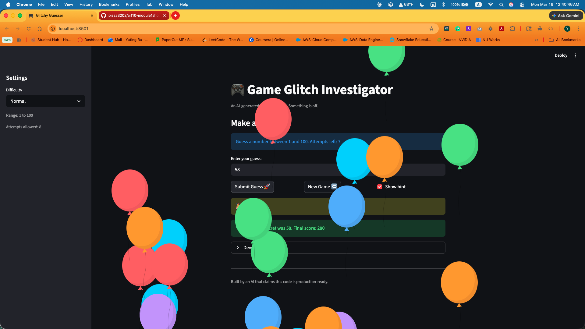
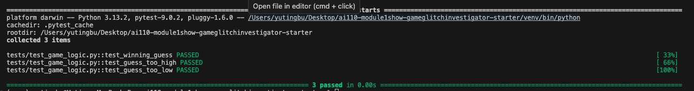

# 🎮 Game Glitch Investigator: The Impossible Guesser

## 🚨 The Situation

You asked an AI to build a simple "Number Guessing Game" using Streamlit.
It wrote the code, ran away, and now the game is unplayable. 

- You can't win.
- The hints lie to you.
- The secret number seems to have commitment issues.

## 🛠️ Setup

1. Install dependencies: `pip install -r requirements.txt`
2. Run the broken app: `python -m streamlit run app.py`

## 🕵️‍♂️ Your Mission

1. **Play the game.** Open the "Developer Debug Info" tab in the app to see the secret number. Try to win.
2. **Find the State Bug.** Why does the secret number change every time you click "Submit"? Ask ChatGPT: *"How do I keep a variable from resetting in Streamlit when I click a button?"*
3. **Fix the Logic.** The hints ("Higher/Lower") are wrong. Fix them.
4. **Refactor & Test.** - Move the logic into `logic_utils.py`.
   - Run `pytest` in your terminal.
   - Keep fixing until all tests pass!

## 📝 Document Your Experience

- Describe the game's purpose.
A number guessing game where the player tries to guess a secret number within a limited number of attempts, with hints after each guess.
- Detail which bugs you found.
1. New Game button didn't reset game status or history, blocking further play
2. Hints were inverted — too high said "Go Higher", too low said "Go Lower"
3. Attempts count and history were displayed one step behind due to render order
4. No validation for out-of-range inputs
- Explain what fixes you applied.
1. Added status and history resets to the New Game button
2. Swapped the hint messages in check_guess
3. Used st.empty() placeholder so attempts display renders after submit logic
4. Added a range check after parse_guess to reject out-of-bound guesses

## 📸 Demo

- [Insert a screenshot of your fixed, winning game here]

## 🚀 Stretch Features

- [ ] [If you choose to complete Challenge 4, insert a screenshot of your Enhanced Game UI here]
